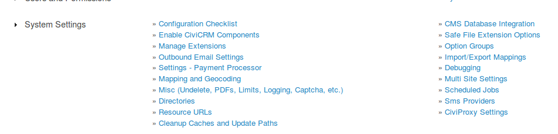
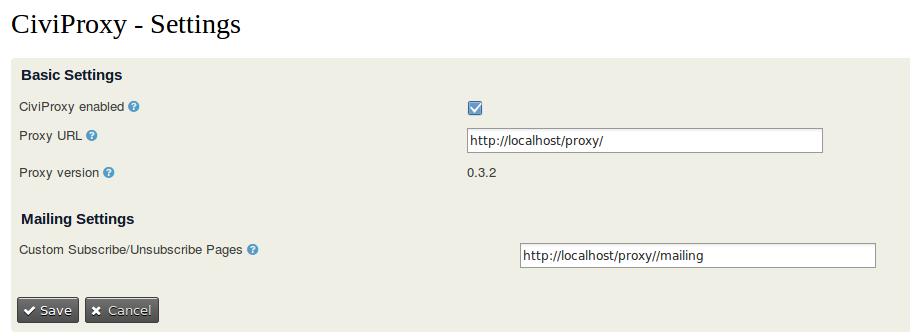

# How to configure CiviProxy
!!! caution
    We assume you have a very basic understanding of PHP and editing PHP files. If you do not, it is probably a good idea to get some support from a CiviCRM expert. You can find one on [Find an Expert](https://civicrm.org/partners-contributors).
## Configuration of the CiviCRM extension
You can use CiviProxy to do a couple of things related to mails and mailing for you.

* You can still see all the stuff on the CiviMailing report like the click-throughs and bounces and such.
* You do not want the links in your bulk mailing or individual mails to immediately feed back to your CiviCRM installation but pass through CiviProxy.
* You want your subscribe/unsubscribe links to pass through CiviProxy rather than go directly to your CiviCRM installation.

If you want to do any of these things, you will need to install and configure the CiviCRM extension **de.systopia.civiproxy** in your CiviCRM installation.

If you have not installed the extension already, check [Installing CiviCRM](installation.md) for instructions how to.

!!! note
    If you do not install the **de.systopia.civiproxy** extension you can still use CiviProxy to whitelist your API requests.

Once you have installed the CiviCRM extension you will need to configure the CiviProxy settings. To do this, go to **Administer>Administration Console**. You will see the CiviProxy Settings in the System Settings section of the menu as you can see below.



If you click on the CiviProxy Settings you will get a page with a few settings for CiviProxy. If you access the page for the first time these will be empty. The settings you can enter are:

1. A checkbox CiviProxy Enabled to enable or disable the CiviProxy functionality with your CiviCRM mailing links.
1. A text field Proxy URL where you can add the URL of your CiviProxy server. This link will be validated and the version of the CiviProxy will be shown. If the URL does not meet the validation (does not contain a valid CiviProxy installation), there will be an error message.
1. A text field Custom Subscribe/Unsubscribe Pages for a path to the unsubscribe page that will be used. There is a basic unsubscribe page on your CiviProxy server, the path to this page will be the default. If the default unsubscribe page is not what you would like, then you can either update the page in the CiviProxy installation on your server or create your own page and set the URL here.

!!! note
    If you do create your own subscription page make sure the parameters and returns and such are the same as in the default unsubscribe page!

In the screen print below you can see the CiviProxy Settings page with the values I have used for my test installation when producing this guide.


## Configuration of the CiviProxy server
The CiviProxy server is the actual policeman that receives all requests and decides if they are allowed to send data to or retrieve data from CiviCRM. It consists of a series of scripts which you need to install on the server as explained in [Installing CiviProxy](installation.md).

Once you have installed your CiviProxy server you need to complete a few configuration steps.
### The Config.php file

The configuration of CiviProxy is mainly controlled with one PHP file called `config.php`. Create this file by copying or renaming the `config.dist.php` file.


### Configuring the URL of your CiviProxy server

First thing you need to configure is the base URL of your CiviProxy server using the `$proxy_base` variable in the `config.php` file. As I have used a local test installation I have used `http://localhost/proxy`:
```php
 // this should point to the base address of the CiviProxy installation
 $proxy_base     = 'http://localhost/proxy';
```
### Configuring the link to the secure target CiviCRM

Next thing you want to configure is what your target CiviCRM is. This is the CiviCRM installation which you want CiviProxy to police, so the one where the actual data resides and is collected from or sent to.

The assumption is that this CiviCRM resides in some kind of VPN and will accept traffic only from the CiviProxy IP address (and probably a few trusted others like home workers or support people).
You can set the URL of the target CiviCRM using the variable `$target_civirm` in the `config.php` file. Again, I have used a local test installation:
```php
 // this should point to the target CiviCRM system
 $target_civicrm = 'http://localhost/ehdev';
```
### Setting for the click tracking url
There is a setting in CiviCRM which is used for tracking the clicks in your mailing. On your CiviProxy server this setting is captured in the variable `$target_url` in the `config.php` file:
```php
$target_url       = $target_civicrm . '/sites/all/modules/civicrm/extern/url.php';
```
If you set it to the value NULL this functionality will not be available on your CiviProxy server.
### Setting for the open tracking
CiviCRM tracks if a mailing has been opened in a certain way. CiviProxy has this setting in the variable `$target_open` in the `config.php` file:
```php
$target_open      = $target_civicrm . '/sites/all/modules/civicrm/extern/open.php';
```
If you set it to the value NULL this functionality will not be available on your CiviProxy server.
### Setting for the location of images and included files in your mail(ing)
CiviCRM stores images and attachments you include in your (bulk) mail in a specific folder. In CiviProxy the name of this folder is stored in variable `$target_file` in the `config.php` file:
```php
$target_file      = $target_civicrm . '/sites/default/files/civicrm/persist/';
```
If you set it to the value NULL this functionality will not be available on your CiviProxy server.

!!! note
    By default CiviProxy will cache the files so it does not have to file from CiviCRM for each individual mail that is part of a bulk mailing. The default settings can be found in the `config.php` file:
    ```php
    /****************************************************************
     **                   File Caching Options                     **
     ****************************************************************/
    // define file cache options, see http://pear.php.net/manual/en/package.caching.cache-lite.cache-lite.cache-lite.php
    $file_cache_options = array(
        'cacheDir' => 'file_cache/',
        'lifeTime' => 86400
    );
    // define regex patterns that shoud NOT be accepted
    $file_cache_exclude = array();
    // if set, cached file must match at least one of these regex patterns
    $file_cache_include = array(
            //'#.+[.](png|jpe?g|gif)#i'           // only media files
    );
    ```
    You can update these settings if you should want to.

    You can find documentation on the caching engine used in CiviProxy [here](http://pear.php.net/manual/en/package.caching.cache-lite.cache-lite.cache-lite.php)
### Setting for the view unformatted mail link
If CiviCRM sends a mail you can get a link to view the mail unformatted. CiviProxy keeps this setting in a variable `$target_mail_view` in the `config.php` file:
```php
$target_mail_view = $target_civicrm . '/civicrm/mailing/view';
```
If you set it to the value NULL this functionality will not be available on your CiviProxy server.
### Setting for the REST API requests
When you want to use the CiviCRM API from another server than the one CiviCRM itself resides on you will do so using the REST interface.

!!! seealso
    Generic information on CiviCRM with REST [here](https://wiki.civicrm.org/confluence/display/CRMDOC/REST+interface)

CiviProxy has a setting which specifies where the REST script is located in the variable `$target_rest` in the `config.php` file:
```php
$target_rest      = $target_civicrm . '/sites/all/modules/civicrm/extern/rest.php';
```
If you set it to the value NULL this functionality will not be available on your CiviProxy server.
### Configuring the API key for (un)subscribe
CiviCRM allows subscribe/unsubscribe links in mailings. To process these a user needs to be configured with a specific API key. In CiviProxy this API key is held in the `config.php` file in variable ``:
```php
$mail_subscription_user_key = 123teSt!ExaMpl1;
```
If you set it to the value NULL this functionality will not be available on your CiviProxy server.
### Configuring the API and Site key
To be able to access your target CiviCRM with the API using REST you will need to configure an API key and a site key. Actually, you will most likely need more to be able if more outside applications are allowed to access your target CiviCRM.

!!! seealso
    Generic information on CiviCRM with REST [here](https://wiki.civicrm.org/confluence/display/CRMDOC/REST+interface)

In CiviProxy you can either store the API and Site keys directly in the `config.php` file or you can include a `secrets.php` file in your installation which holds your key values.

Whatever method you prefer, you will have to end up with an array like the one below:
```php
$api_key_map = array('eR1k!tSt4321' => 'cal1Mer0#tST');
$sys_key_map = array('1234#tsT#eR1k' => 'p1P0!tEst1Ng5678');
```
As you can see you can give the application that is accessing you different keys than the ones you use to access your target CiviCRM.

So in this example I will explain to the party wanting to access my CiviProxy that they have to use the key _1234#tsT#eR1k_ and the api key _eR1k!tSt4321_. My target CiviCRM will expect site key _p1P0!tEst1Ng5678_ and the api key _cal1Mer0#tST_.

### Whitelisting API requests
Even if you have entered your API and Site key, and the setting for the target REST is ok, you will not be able to use any API calls through CiviProxy just yet. As CiviProxy uses the **whitelisting** principle by default **no** API calls are allowed unless they have been whilelisted.

Also **parameter sanitation** is used. This means that only the specified parameters are allowed, and only content data of the specified type will be allowed.

You can whitelist an API entity and action (and a set of allowed parameters) for all request from outside, but you can also whitelist an API entity and action ONLY if it comes from a specific IP address.

!!! note
    The address of the request is checked with the PHP variable `$_SERVER['REMOTE_ADDR']`

In the example below you will see the possible configuration:

* the API `Contact getsingle` with parameter `email` is allowed for all servers making a request to CiviProxy,
* the API `Contact getsingle` with parameters `first_name` and `last_name` is only allowed if it is requested from IP address 123.45.678.1.

```php
$rest_allowed_actions = array(
  'all' => array(
    'Contact' => array(
      'getsingle' => array(
        'email' => 'string',
      ),
    ),
  ),
  '123.45.678.1' => array(
    'Contact' => array(
      'getsingle' => array(
        'first_name' => 'string',
        'last_name' => 'string',
      ),
    ),
  ),
);
```

!!! note
    In earlier versions of CiviProxy this format was allowed for `$rest_allowed_actions`:
    ```php
    $rest_allowed_actions = array(
    	'Contact' => array(
    		'getsingle' => array(
    			'email' => 'string',
    		),
    	),
    );
    ```
    That format will still work, but is considered **deprecated** and you are encouraged to adapt to the new format described in the section above.

!!! caution
    A little bit of developer background....Obviously you can use the core CiviCRM API's but you have to think carefully of the parameter sanitation. Techically what happens is that if any parameters are passed to CiviProxy that are not _allowed_, they are ignored when the API request is passed to CiviCRM. This could lead to undesired behaviour. Consider this example:

    * we have allowed the `Contact Get` API with only the parameter `email`

    * the request we get in CiviProxy has the `Contact Get` but the parameters `first_name` and `last_name`

    * because `first_name` and `last_name` are not whitelisted, they get ignored and a `Contact Get` without parameters if passed to the target CiviCRM, returning the first 25 contacts are a result...which is not what we wanted.

    We recommend solving these situations by developing specific API's rather than using the core ones. And if you think of a good solution feel free to raise an issue or do a PR!

### Debug setting
CiviProxy has a `$debug` setting which allows you to add the name of a text file where all requests are send to. This can be used during the initial testing to see if everything is processed correcty.
```php
// CAREFUL: only enable temporarily on debug systems. Will log all queries to given PUBLIC file
$debug                      = NULL; //'debug.log';
```
If you set the `$debug` setting to NULL this feature will not be used.

!!! warning
    We recommend only using this debug feature in the testing face, never on an active production installation as it can produce a massive log file quite easily.
### Target Interface setting
There is a setting for a local network interface or IP to be used for relayed queries. If you have no idea what this is about, just leave it as is.
```php
// Local network interface or IP to be used for the relayed query
// This is usefull in some VPN configurations (see CURLOPT_INTERFACE)
$target_interface           = NULL;
```

!!! tip
    We do advice you to monitor what request are still being fired directly to your target CiviCRM once you installed and configured CiviProxy, and then find solutions for the situations if you still see some undesired access requests.
