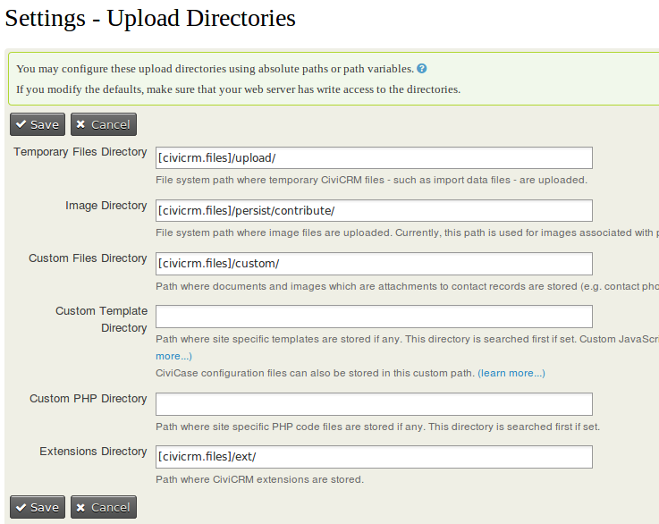
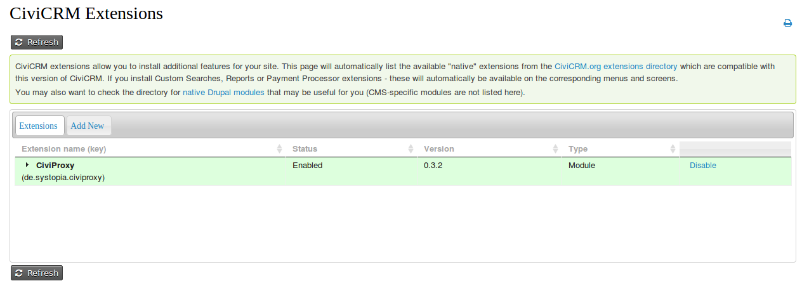

# Installation
CiviProxy has to run on its own server (with its own IP address) for maximum effect.

The best option for a server on which you can install CiviProxy is a simple managed webspace, that you can rent cheaply from the hoster of your choice. It should have its own IP address, but other than that there are virtually no restrictions. This approach comes with a lot of advantages:

* Since there are a multitude of clients like you on such a server, the level of security can be expected to be very high, and it should be managed and monitored by professionals 24/7.
* For the same reason, the bandwith and connectivity of such a server should be very high as well.
* The price should not have to be huge.

!!! note
    Obviously there is nothing stopping you from installing CiviProxy on a server you manage yourself, but that then automatically means you have to ensure you maintain a high level of security and update the stuff regularly!

Installing CiviProxy should be pretty straightforward:

* Download the GitHub repository from [https://github.com/systopia/CiviProxy](https://github.com/systopia/CiviProxy).
* In your repository are actually two relevant parts:

    * A CiviCRM extension called **de.systopia.civiproxy** that you can use to send mailings (newsletters) from CiviCRM. This should be installed on your target CiviCRM installation.
    * A **proxy** folder with the scripts that you need to install on your CiviProxy server.
    * On top of that there will also be a **docs** folder containing this guide and a few necessary files (which are needed but you can ignore):
        * LIBRARIES.md
        * LICENSE
        * README.md
        * mkdocs.yml
## Installing the CiviCRM extension on your target CiviCRM
* copy the folder **de.systopia.civiproxy** that you downloaded in the previous step into your CiviCRM extensions folder. You should be able to find your civicrm extensions folder in **Administer>System Settings>Directories**. If you have never touched or changed this it will look like screen print below. In that case your folder is probably `<your civicrm folder>/sites/default/files/civicrm/ext/`

!!! seealso
    

* go to **Administer>System Settings>Extensions** to see a page with all the installed extensions on your CiviCRM installation. You will have to click the **Refresh** button to see the **de.systopia.civiproxy** extension. Click the **Install** action listed behind the extension information. Upon successfull installation you should see a list like the one below (although you will probably see a larger list as you will have more extensions installed).

!!! seealso
    

* type the URL`http://example.org/civicrm/clearcache` to clear the caches and rebuild the menu. This is necessary to add the CiviProxy settings page to CiviCRM.

!!! note
    use the URL `http://example.org/?q=civicrm/clearcache` if CleanUrls are not enabled

* you should now be able to access the CiviProxy Settings page with **Administer>Administration Console** (in the menu section System Settings) or with the URL `http://example.org/civicrm/admin/setting/civiproxy`.

!!! note
    use the URL `http://example.org/?q=civicrm/admin/setting/civiproxy` if CleanUrls are not enabled

!!! note
    If you want to you can add the CiviProxy Settings page to your Administration menu with Administer/Customize Data and Screens/Navigation Menu.

* check the [Configuring CiviProxy](configuration.md) page to see how to configure the CiviProxy extension.

## Installing the Proxy scripts your your CiviProxy server

1. Copy the **proxy** folder on the webspace you want to use for CiviProxy
2. Create a `config.php` file using `config.dist.php` as a template.

See [Configuring CiviProxy](configuration.md) for  details on what you need to include in the `config.php` file.
